# 📐 Arquitetura do Sistema CRM - Diagramas Mermaid

## 📋 Índice
1. [Arquitetura Geral](#arquitetura-geral)
2. [Modelo de Dados (ER)](#modelo-de-dados)
3. [Fluxo de Autenticação](#fluxo-de-autenticação)
4. [Fluxo de Conversão de Lead](#fluxo-de-conversão-de-lead)
5. [Fluxo do Kanban](#fluxo-do-kanban)
6. [Hierarquia de Permissões](#hierarquia-de-permissões)
7. [Estrutura de Diretórios](#estrutura-de-diretórios)

---

## 1. Arquitetura Geral

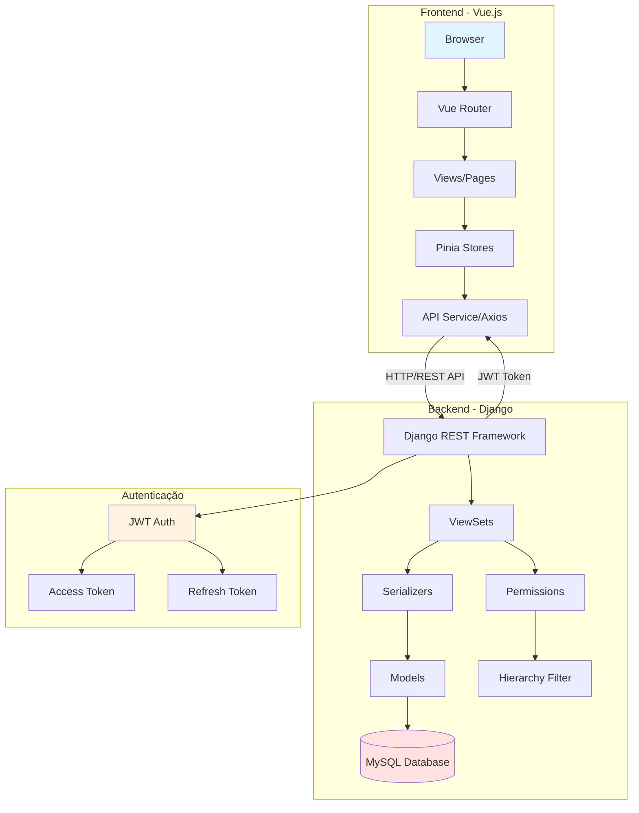

---

## 2. Modelo de Dados (ER)

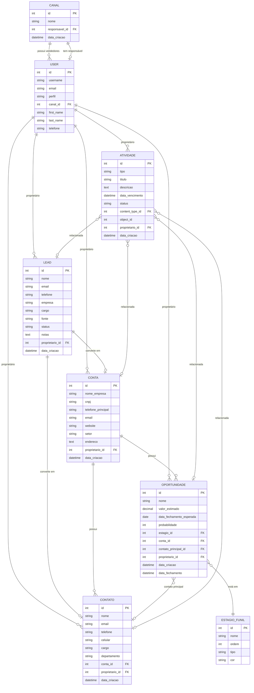

---

## 3. Fluxo de Autenticação

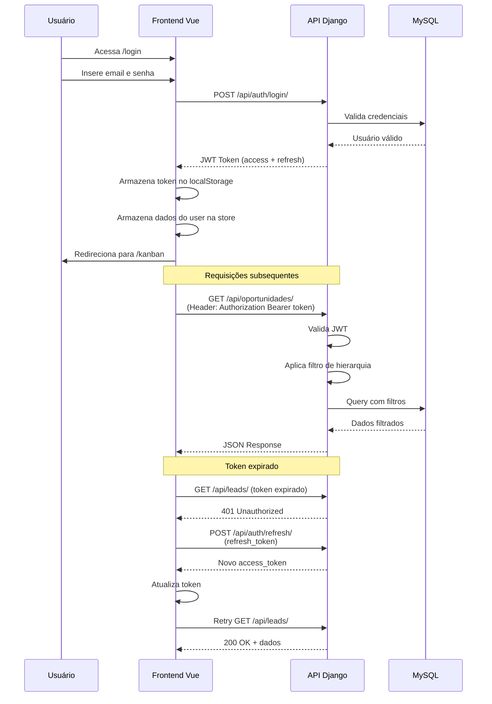

---

## 4. Fluxo de Conversão de Lead

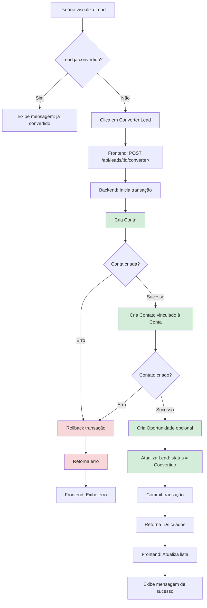

---

## 5. Fluxo do Kanban (Drag and Drop)

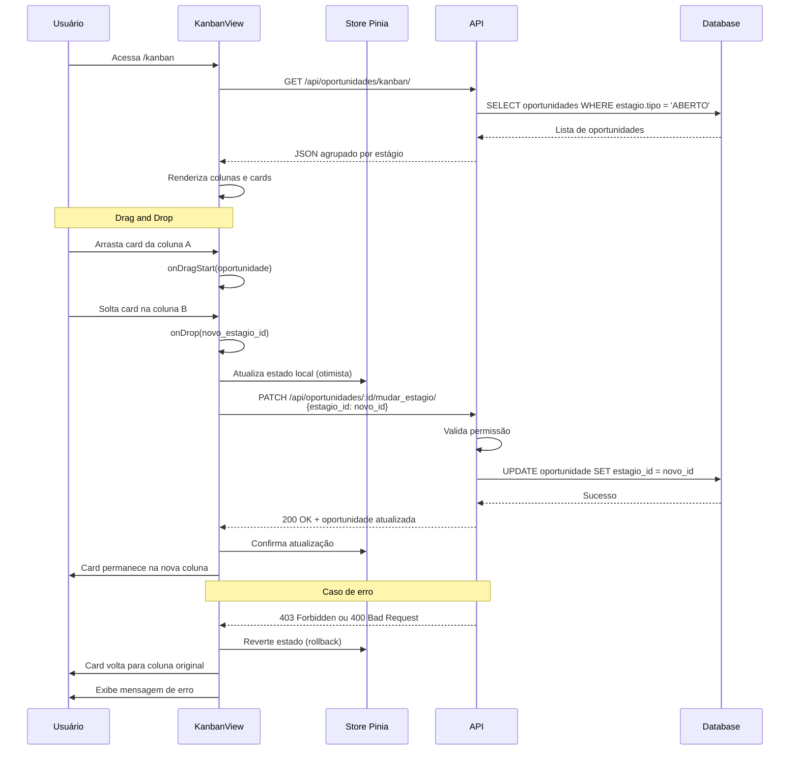

---

## 6. Hierarquia de Permissões

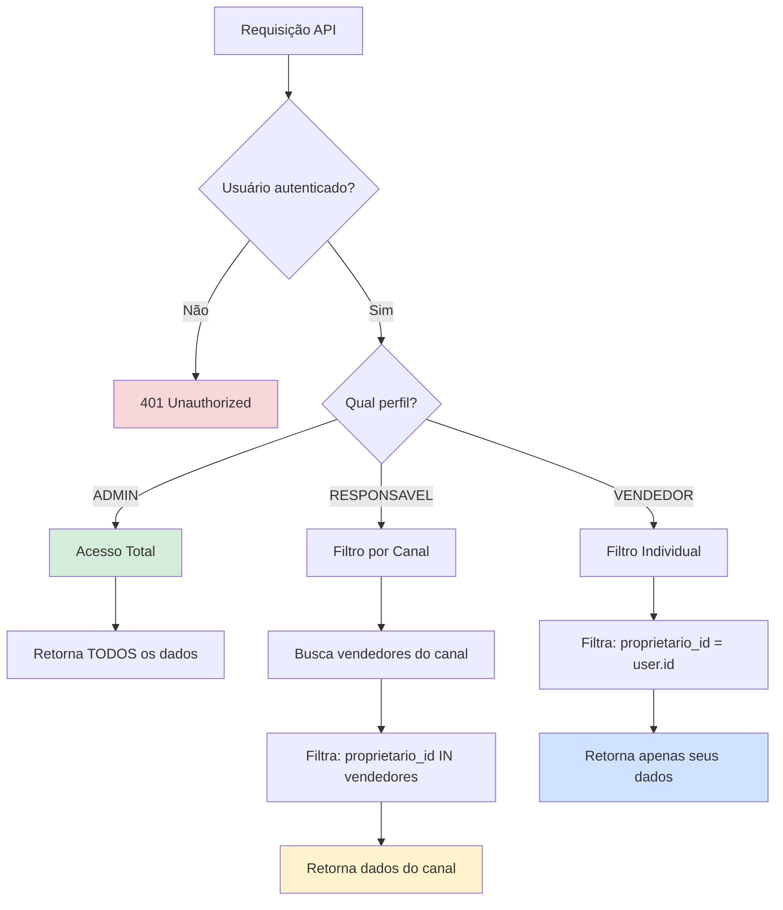

### Matriz de Permissões

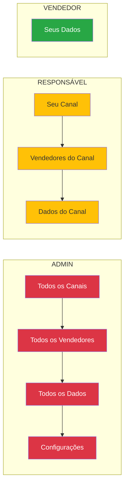

---

## 7. Estrutura de Diretórios

```mermaid
graph TD
    ROOT[crm_wp/] --> BACKEND[backend/]
    ROOT --> FRONTEND[frontend/]
    ROOT --> DOCS[Documentação]
    
    BACKEND --> CONFIG[config/]
    BACKEND --> CRM[crm/]
    BACKEND --> MANAGE[manage.py]
    BACKEND --> REQ[requirements.txt]
    
    CONFIG --> SETTINGS[settings.py]
    CONFIG --> URLS_B[urls.py]
    CONFIG --> WSGI[wsgi.py]
    
    CRM --> MODELS[models.py]
    CRM --> VIEWS[views.py]
    CRM --> SERIALIZERS[serializers.py]
    CRM --> PERMISSIONS[permissions.py]
    CRM --> URLS_C[urls.py]
    CRM --> ADMIN[admin.py]
    
    FRONTEND --> SRC[src/]
    FRONTEND --> PUBLIC[public/]
    FRONTEND --> PACKAGE[package.json]
    FRONTEND --> VITE[vite.config.js]
    
    SRC --> VIEWS_F[views/]
    SRC --> STORES[stores/]
    SRC --> SERVICES[services/]
    SRC --> ROUTER[router/]
    SRC --> LAYOUTS[layouts/]
    SRC --> COMPONENTS[components/]
    SRC --> ASSETS[assets/]
    
    VIEWS_F --> LOGIN[LoginView.vue]
    VIEWS_F --> KANBAN[KanbanView.vue]
    VIEWS_F --> LEADS[LeadsView.vue]
    VIEWS_F --> CONTAS[ContasView.vue]
    VIEWS_F --> ADMIN_V[admin/]
    
    STORES --> AUTH[auth.js]
    STORES --> OPORT[oportunidades.js]
    
    SERVICES --> API[api.js]
    
    DOCS --> README[README.md]
    DOCS --> PROJETO[projeto.md]
    DOCS --> FEATURES[FEATURES.md]
    DOCS --> SETUP[SETUP_GUIDE.md]
    
    style ROOT fill:#e1f5ff
    style BACKEND fill:#ffe1e1
    style FRONTEND fill:#e1ffe1
    style DOCS fill:#fff4e1
```

---

## 8. Fluxo Completo: Jornada do Vendedor

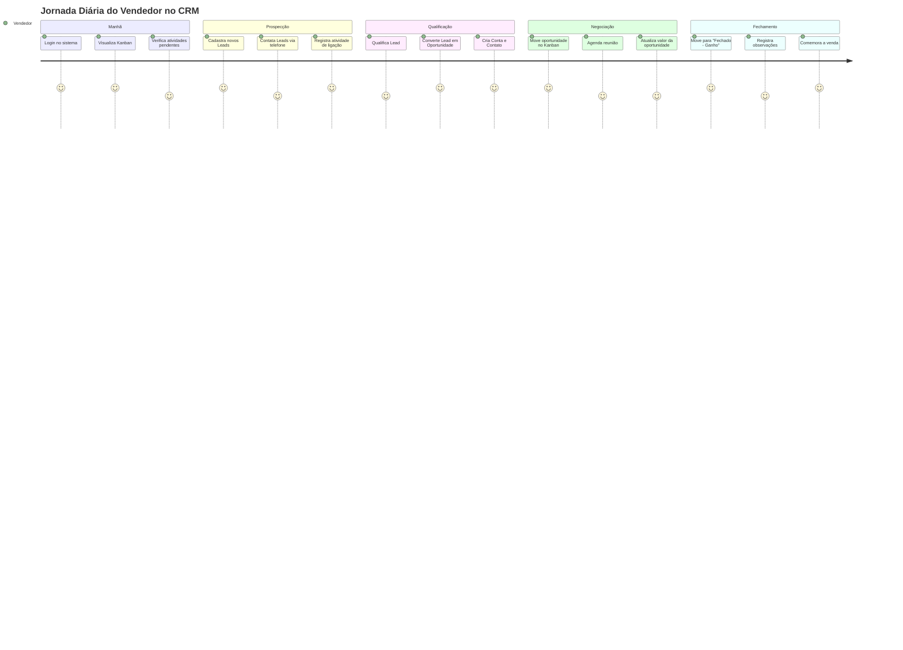

---

## 9. Ciclo de Vida de uma Oportunidade

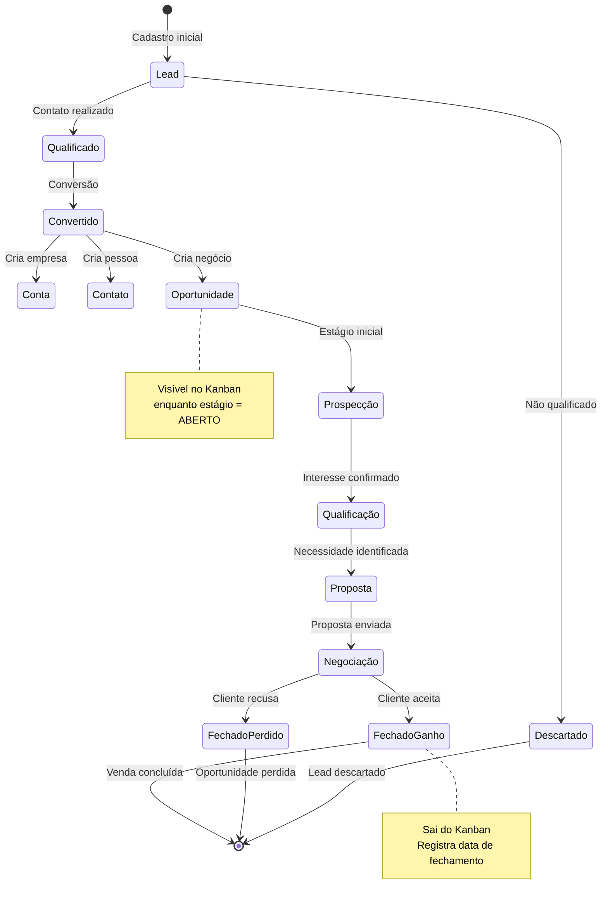

---

## 10. Arquitetura de Componentes Vue

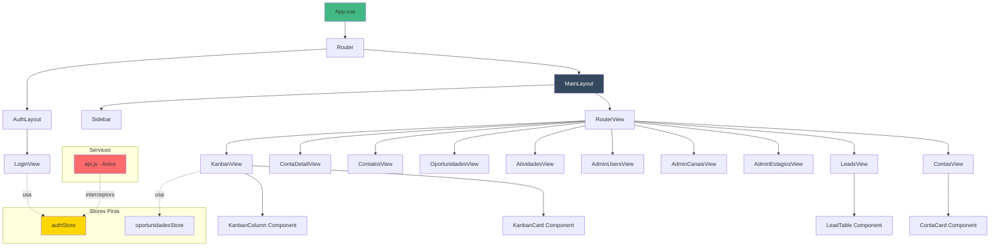

---

## 11. Pipeline de Requisição API

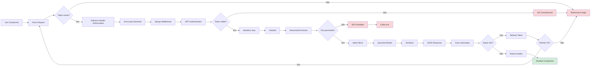

---

## 12. Modelo de Segurança

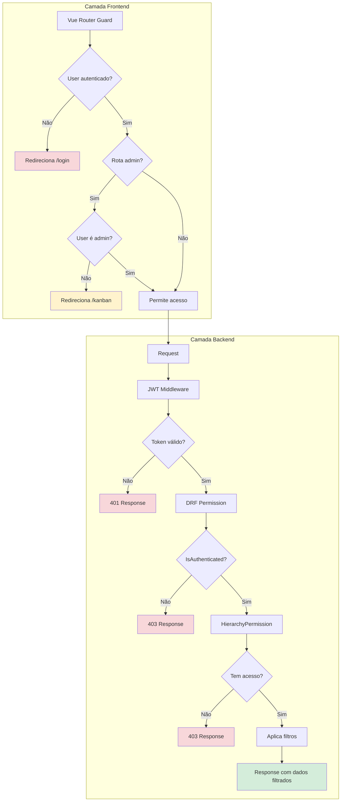

---

## 📊 Resumo da Arquitetura

### Stack Tecnológica
- **Frontend**: Vue.js 3 + Vite + Pinia + Vue Router + Tailwind CSS
- **Backend**: Django 4.2 + Django REST Framework + JWT
- **Database**: MySQL 8.0
- **Autenticação**: JWT (Access + Refresh Token)

### Principais Padrões
- **Arquitetura**: REST API + SPA
- **State Management**: Pinia (Vuex successor)
- **Permissions**: Custom HierarchyPermission
- **Relacionamentos**: GenericForeignKey para atividades polimórficas
- **Drag and Drop**: HTML5 Drag and Drop API

### Módulos Principais
1. **Autenticação** (JWT)
2. **Leads** (Prospecção)
3. **Contas** (Empresas)
4. **Contatos** (Pessoas)
5. **Oportunidades** (Negócios)
6. **Atividades** (Tarefas/Ligações/Reuniões)
7. **Kanban** (Funil Visual)
8. **Admin** (Usuários/Canais/Estágios)

---

**Documentação gerada automaticamente para o Sistema CRM de Vendas** 🚀
