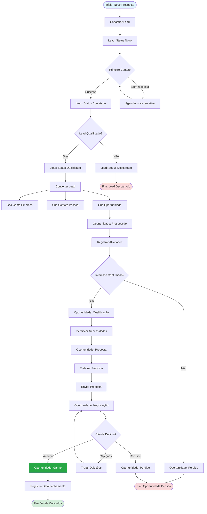
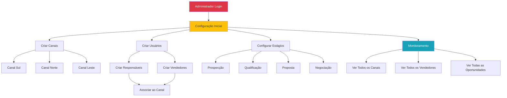
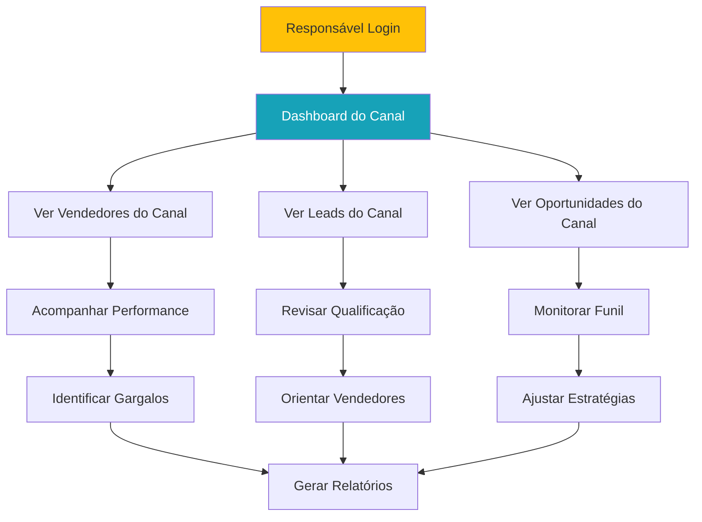
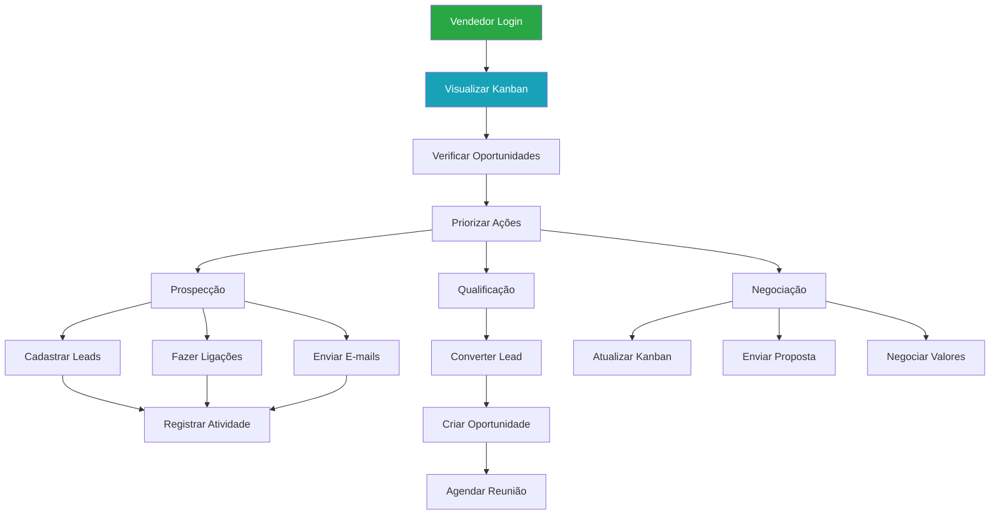
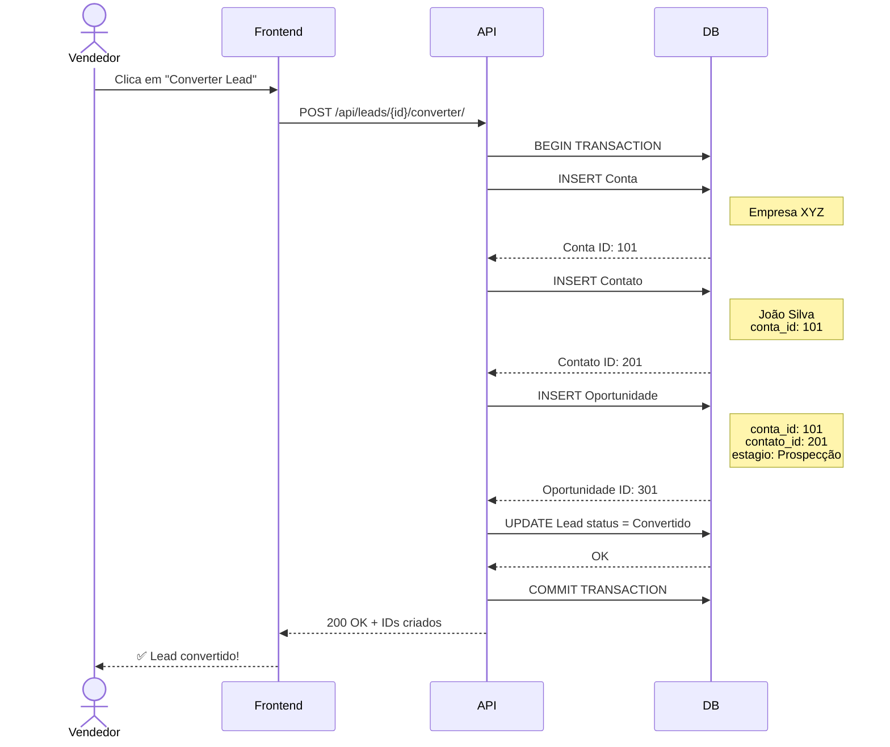
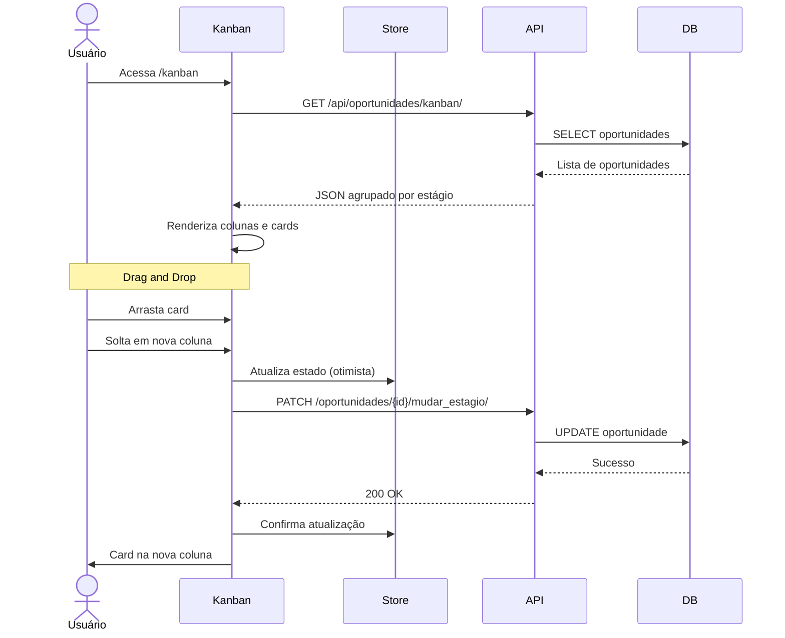
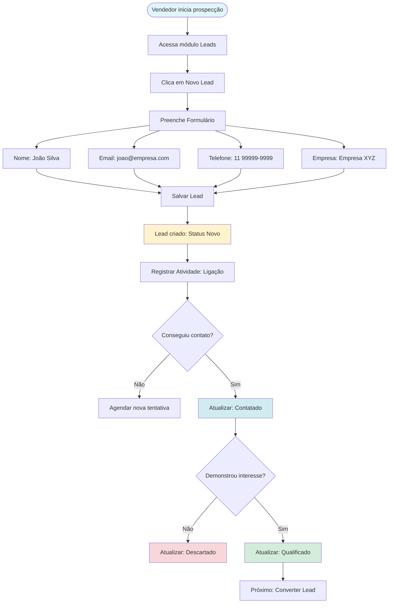
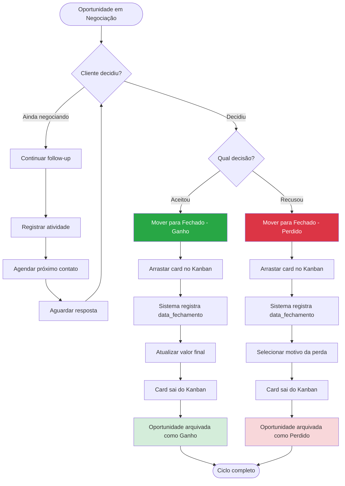
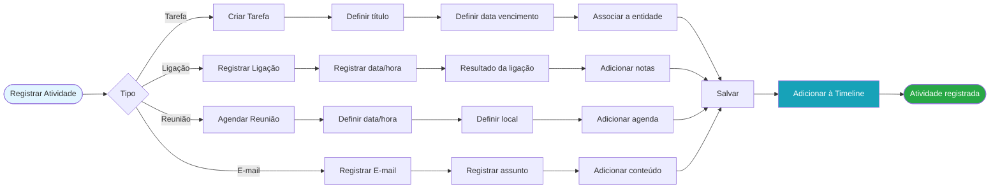
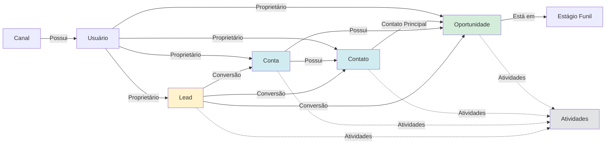

# 🔄 Fluxo Operacional do Sistema CRM

Este documento descreve os fluxos operacionais do dia a dia do sistema CRM, mostrando como cada perfil de usuário interage com o sistema.

---

## 1. Fluxo Completo de Vendas

---

## 2. Operações por Perfil de Usuário

### 2.1 Fluxo do Administrador

### 2.2 Fluxo do Responsável de Canal

### 2.3 Fluxo do Vendedor

---

## 3. Fluxo de Conversão de Lead

---

## 4. Fluxo do Kanban (Drag and Drop)

---

## 5. Fluxo de Prospecção

---

## 6. Fluxo de Fechamento

---

## 7. Fluxo de Atividades

---

## 8. Matriz de Permissões

| Operação | Admin | Responsável | Vendedor |
|----------|-------|-------------|----------|
| Criar Canais | ✅ | ❌ | ❌ |
| Criar Usuários | ✅ | ❌ | ❌ |
| Configurar Estágios | ✅ | ❌ | ❌ |
| Ver todos os dados | ✅ | ❌ | ❌ |
| Ver dados do canal | ✅ | ✅ | ❌ |
| Ver próprios dados | ✅ | ✅ | ✅ |
| Criar Leads | ✅ | ✅ | ✅ |
| Converter Leads | ✅ | ✅ | ✅ |
| Criar Oportunidades | ✅ | ✅ | ✅ |
| Mover no Kanban | ✅ | ✅ | ✅ |
| Registrar Atividades | ✅ | ✅ | ✅ |

---

## 9. Fluxo de Dados entre Módulos

---

**Documentação de Fluxos Operacionais - Sistema CRM** 🚀
